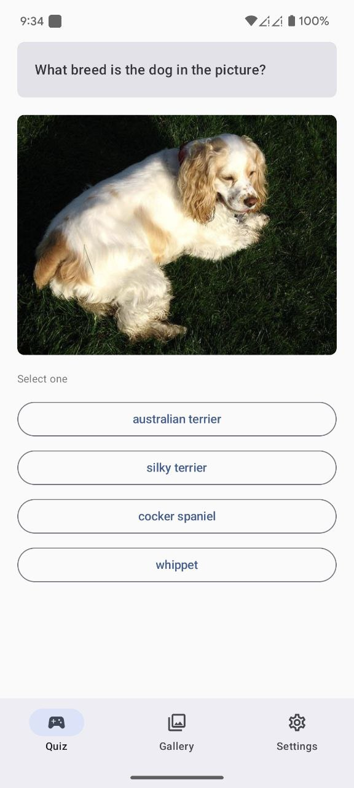
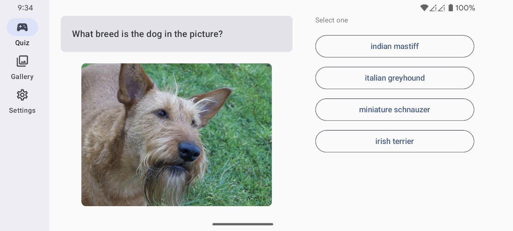

# DogCeo Demo

  
  

This is an Android demo app that utilizes the [Dog CEO API](https://dog.ceo/dog-api/documentation/) as the backend.  
The app includes a **Quiz Page**, where a random dog image is displayed along with four possible breed options. Your task is to guess the correct breed.

## Architecture

This demo follows the Android recommended [architecture](https://developer.android.com/topic/architecture).  
The code is structured as follows:

- **`presentation`** - UI Layer  
- **`domain`** - Domain Layer  
- **`data`** - Data Layer  
- **`di`** - Dependency Injection  

The **UI Layer** is built using Jetpack Compose and follows the **MVVM** architecture.

## Tech Stack

- **Image Loading**: Coil  
- **Networking**: Retrofit + OkHttp  
- **Dependency Injection**: Hilt  
- **JSON Serialization**: Moshi  
- **Unit Testing**: JUnit, MockK  

---

Feel free to explore the code
